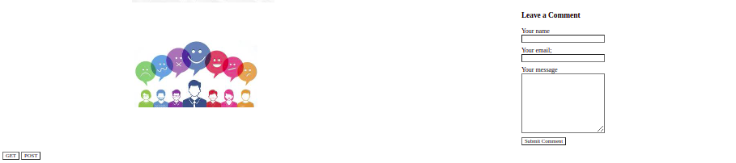

# sentiment-Analyzer-App
####  The Sentiment-Analyzer App is a powerful tool that allows marketers to gather insights into customer emotion, providing unparalleled data regarding how we perceive products and brands.,26/06/2022
#### By **Gitau Elvis Munene**
## Description
With this app, marketers can research how customers feel about a product, brand, and competitor in relation to their own personal experience. The app also allows the creation of custom surveys to discover the most prevalent emotions in your customer base.
# Public API link
https://github.com/words/afinn-111
## Setup/Installation Requirements
* Visual Studio
* Installation of dependancies for instance package.json and package-lock.json
* Server.
## Known Bugs
The application is capable of giving sentiments once installed on your local machine.
## Technologies Used
*HTML
*CSS
*Javascript
## Support and contact details
Email: elvisgitau10@gmail.com
slack: Gitau Elvis

### License
 **MIT License Copyright (c) 2022 Elvis Munene*